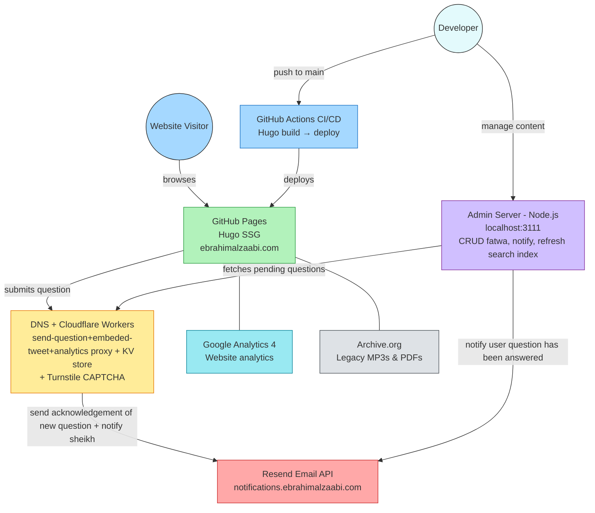

# ebrahimalzaabi.com

Hugo-based website for Sheikh Ibrahim Saif Al-Zaabi.

## Architecture



### Tech Stack

| Service | Purpose |
|---|---|
| [GitHub](https://github.com/) | Source code, GitHub Pages hosting, GitHub Actions CI/CD |
| [Cloudflare Workers](https://workers.cloudflare.com/) | Question submission backend |
| [Cloudflare Turnstile](https://www.cloudflare.com/products/turnstile/) | CAPTCHA for the question form |
| [Cloudflare KV](https://developers.cloudflare.com/kv/) | Stores pending questions for admin review |
| [Resend](https://resend.com/) | Transactional emails (notifications to sheikh & questioners) |
| [Google Analytics 4](https://analytics.google.com/) | Website analytics |
| [Archive.org](https://archive.org/) | Hosting legacy MP3s & PDFs |

> All services above are accessible via the Google account **ebrahimalzaabi.seed@gmail.com**.

## Prerequisites

- [Hugo](https://gohugo.io/installation/) (extended version)
- [Node.js](https://nodejs.org/) (for search index generation)
- [Python 3](https://www.python.org/) (optional - for YouTube transcript extraction in the admin panel via [youtube-transcript-api](https://github.com/jdepoix/youtube-transcript-api))
- Git with submodule support (theme is a submodule)

## Local Development

### 1. Clone with submodules

```bash
git clone --recurse-submodules https://github.com/ebrahimalzaabi-seed/ebrahimalzaabi.com.git
```

If already cloned without submodules:

```bash
git submodule update --init --recursive
```

### 2. Install Node dependencies

```bash
npm install
```

### 3. Set up Python virtual environment (optional - for transcript extraction)

```bash
python3 -m venv scripts/.venv
scripts/.venv/bin/pip install youtube-transcript-api
```

Skip this step if you don't need YouTube transcript extraction in the admin panel.

### 4. Create `scripts/.env`

```env
RESEND_API_KEY=re_your_key_here
NOTIFY_EMAIL_PRIMARY=...
NOTIFY_EMAIL_DEV=...
```

- `RESEND_API_KEY` — Required for the admin panel's email notification feature. Get the key from [Resend](https://resend.com/).
- `NOTIFY_EMAIL_PRIMARY` — The sheikh's email that receives question notifications in production.
- `NOTIFY_EMAIL_DEV` — The developer email used for dry-run mode and BCC on all notifications.


### 5. Run the dev server

```bash
hugo server
```

The site will be available at `http://localhost:1313`.

## Deployment

Deployment is automated via GitHub Actions on every push to `main`.

The workflow at `.github/workflows/hugo-deploy.yml`:
1. Builds the site with `hugo --minify --baseURL "https://ebrahimalzaabi.com/"`
2. Deploys the `./public` output to **GitHub Pages**

To trigger a manual deploy, use the **Run workflow** button in the GitHub Actions tab (`workflow_dispatch` is enabled).

### Production URL

`https://ebrahimalzaabi.com`

## Admin Panel

Local-only tool for managing fatawa and pending questions.

```bash
npm run admin
```

Opens at **http://localhost:3111**. From here you can create/edit/delete fatawa, view pending questions from Cloudflare KV, notify questioners when answered, and rebuild the search index.

## Cloudflare Worker (`workers/send-question/`)

Handles question form submissions from the `/fatawa/` page. Validates Turnstile CAPTCHA, sends emails via Resend, and stores questions in KV.

```bash
cd workers/send-question
npm install
npx wrangler deploy   # deploy to Cloudflare
```

**Secrets** (secrets are deployed via `npx wrangler secret put <NAME>`).  To list them: `npx wrangler secret list`
- `RESEND_API_KEY` (from [Resend dashboard](https://resend.com/api-keys))
- `TURNSTILE_SECRET_KEY` (from [Cloudflare Turnstile dashboard](https://dash.cloudflare.com/?to=/:account/turnstile))
- `ADMIN_API_KEY` (any secure random string — must match the value in `scripts/admin-server.js`)
- `NOTIFY_EMAIL_PRIMARY` — The sheikh's email that receives question notifications in production. Must match the value in `scripts/.env`.
- `NOTIFY_EMAIL_DEV` — The developer email BCC on all notifications. Must match the value in `scripts/.env`.

## Cloudflare Worker (`workers/analytics-proxy/`)

Proxies the Google Analytics 4 Data API with 24-hour caching. Uses a GCP service account for JWT authentication.

```bash
cd workers/analytics-proxy
npm install
npx wrangler deploy   # deploy to Cloudflare
```

**Secrets** (secrets are deployed via `npx wrangler secret put <NAME>`).  To list them: `npx wrangler secret list`
- `GA4_PROPERTY_ID` — GA4 numeric property ID
- `GCP_CLIENT_EMAIL` — GCP service account email
- `GCP_PRIVATE_KEY` — GCP service account private key (PEM format)

For local development, create `workers/analytics-proxy/.dev.vars` with these values (already gitignored).

## Dry Run Mode

Dry run mode prevents real emails from reaching the sheikh during development and testing. Instead, all emails are redirected to the dev email (`NOTIFY_EMAIL_DEV`).

It is activated in two places:

- **Question submission worker** — automatically enabled when the form is submitted from `localhost` (checks `window.location.hostname`). The sheikh notification email is sent to `NOTIFY_EMAIL_DEV` instead of `NOTIFY_EMAIL_PRIMARY`.
- **Admin panel** — a checkbox in the notify section lets you toggle dry run on/off when sending a "your question has been answered" email.

