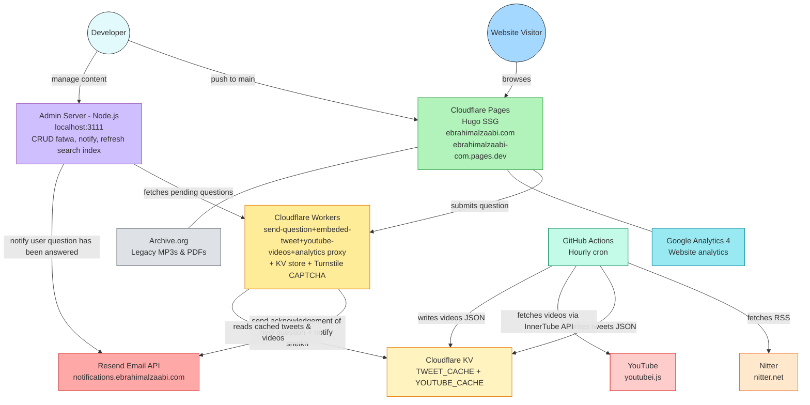

# ebrahimalzaabi.com

Hugo-based website for Sheikh Ibrahim Saif Al-Zaabi.

## Philosophy

This project is built around three principles:

1. **Zero cost, maximum sustainability** — Every service used is free-tier. No credit card is attached to any account. The only paid component is the domain name `ebrahimalzaabi.com` (paid through 2031), but the site remains permanently accessible at https://ebrahimalzaabi-com.pages.dev/ regardless of domain renewal. If funding ever stops, nothing breaks — the site keeps running indefinitely.

2. **Ready for handoff** — A new developer should be able to clone the repo and have a working local site in minutes. All infrastructure is documented in this README, all secrets are listed explicitly, and the architecture is intentionally simple (static site + lightweight workers). There is no complex CI/CD pipeline, no containers, no databases — just `git clone`, `npm install`, and `hugo server`.

3. **One credential for everything** — All third-party services (GitHub, Cloudflare, Google Analytics, Resend, GCP, Archive.org) are registered under a single shared Google account: **ebrahimalzaabi.seed@gmail.com**. One login, one password, one 2FA — no scavenger hunt across accounts when it's time to hand over the project.

## Architecture


```mermaid
graph TD
    Visitor((Website Visitor))
    Dev((Developer))

    Visitor -->|browses| CFP[Cloudflare Pages<br/>Hugo SSG<br/>ebrahimalzaabi.com<br/>ebrahimalzaabi-com.pages.dev]
    CFP -->|submits question| CF[Cloudflare Workers<br/>send-question+embeded-tweet+youtube-videos+analytics proxy<br/>+ KV store + Turnstile CAPTCHA]

    CFP --- GA4[Google Analytics 4<br/>Website analytics]
    CFP --- Archive[Archive.org<br/>Legacy MP3s & PDFs]
    Dev -->|push to main| CFP
    Dev -->|manage content| Admin

    CF -->|send acknowledgement of new question + notify sheikh| Resend[Resend Email API<br/>notifications.ebrahimalzaabi.com]

    Admin[Admin Server - Node.js<br/>localhost:3111<br/>CRUD fatwa, notify, refresh search index] -->|fetches pending questions| CF
    Admin -->|notify user question has been answered| Resend

    GHA[GitHub Actions<br/>Hourly cron] -->|fetches RSS| Nitter[Nitter<br/>nitter.net]
    GHA -->|writes tweets JSON| KV[Cloudflare KV<br/>TWEET_CACHE + YOUTUBE_CACHE]
    GHA -->|fetches videos via InnerTube API| YT[YouTube<br/>youtubei.js]
    GHA -->|writes videos JSON| KV
    CF -->|reads cached tweets & videos| KV

    style Dev fill:#e3fafc,stroke:#1e1e1e
    style Visitor fill:#a5d8ff,stroke:#1e1e1e
    style CFP fill:#b2f2bb,stroke:#2f9e44
    style CF fill:#ffec99,stroke:#e67700
    style Admin fill:#d0bfff,stroke:#862e9c
    style Resend fill:#ffa8a8,stroke:#c92a2a
    style GA4 fill:#99e9f2,stroke:#0c8599
    style Archive fill:#dee2e6,stroke:#495057
    style GHA fill:#c3fae8,stroke:#087f5b
    style Nitter fill:#ffe8cc,stroke:#e8590c
    style KV fill:#fff3bf,stroke:#e67700
    style YT fill:#fcc,stroke:#c00
```

### Tech Stack

| Service | Purpose |
|---|---|
| [GitHub](https://github.com/) | Source code repository + Actions cron for tweet & YouTube refresh |
| [Cloudflare Pages](https://pages.cloudflare.com/) | Static site hosting (auto-deploys on push to main) |
| [Cloudflare Workers](https://workers.cloudflare.com/) | Question submission backend |
| [Cloudflare Turnstile](https://www.cloudflare.com/products/turnstile/) | CAPTCHA for the question form |
| [Cloudflare KV](https://developers.cloudflare.com/kv/) | Stores pending questions, cached tweets, and cached YouTube videos |
| [Resend](https://resend.com/) | Transactional emails (notifications to sheikh & questioners) |
| [Google Analytics 4](https://analytics.google.com/) | Website analytics |
| [Archive.org](https://archive.org/) | Hosting legacy MP3s & PDFs |

> All services above are accessible via the Google account **ebrahimalzaabi.seed@gmail.com**.

## Prerequisites

- [Hugo](https://gohugo.io/installation/) (extended version)
- [Node.js](https://nodejs.org/) (for search index generation)
- [Python 3](https://www.python.org/) (optional - for YouTube transcript extraction in the admin panel via [youtube-transcript-api](https://github.com/jdepoix/youtube-transcript-api))
- Git with submodule support (theme is a submodule)

## Local Development

### 1. Clone with submodules

```bash
git clone --recurse-submodules https://github.com/ebrahimalzaabi-seed/ebrahimalzaabi.com.git
```

If already cloned without submodules:

```bash
git submodule update --init --recursive
```

### 2. Install Node dependencies

```bash
npm install
```

### 3. Set up Python virtual environment (optional - for transcript extraction)

```bash
python3 -m venv scripts/.venv
scripts/.venv/bin/pip install youtube-transcript-api
```

Skip this step if you don't need YouTube transcript extraction in the admin panel.

### 4. Create `scripts/.env`

```env
RESEND_API_KEY=re_your_key_here
NOTIFY_EMAIL_PRIMARY=...
NOTIFY_EMAIL_DEV=...
```

- `RESEND_API_KEY` — Required for the admin panel's email notification feature. Get the key from [Resend](https://resend.com/).
- `NOTIFY_EMAIL_PRIMARY` — The sheikh's email that receives question notifications in production.
- `NOTIFY_EMAIL_DEV` — The developer email used for dry-run mode and BCC on all notifications.


### 5. Run the dev server

In one terminal, start Hugo:

```bash
hugo server
```

In another terminal, start all Cloudflare Workers locally:

```bash
npm run workers
```

The site will be available at `http://localhost:1313`. The workers run on their respective local ports (see each worker's `wrangler.toml` for details).

## Deployment

Deployment is automated via **Cloudflare Pages** on every push to `main`. No GitHub Actions workflow is needed — Cloudflare Pages watches the repo directly.

Build configuration (set in Cloudflare Pages dashboard):
- **Build command**: `npm install && npm run build-index && hugo --gc --minify`
- **Output directory**: `public`
- **Environment variables**: `HUGO_VERSION=0.147.1`, `HUGO_ENVIRONMENT=production`, `TZ=Asia/Dubai`

### Production URLs

- `https://ebrahimalzaabi.com` (custom domain)
- `https://ebrahimalzaabi-com.pages.dev` (Cloudflare Pages subdomain)

Both URLs serve the site independently with no redirects.

## Admin Panel

Local-only tool for managing fatawa and pending questions.

```bash
npm run admin
```

Opens at **http://localhost:3111**. From here you can create/edit/delete fatawa, view pending questions from Cloudflare KV, notify questioners when answered, and rebuild the search index.

## Cloudflare Worker (`workers/send-question/`)

Handles question form submissions from the `/fatawa/` page. Validates Turnstile CAPTCHA, sends emails via Resend, and stores questions in KV.

```bash
cd workers/send-question
npm install
npx wrangler deploy   # deploy to Cloudflare
```

**Secrets** (secrets are deployed via `npx wrangler secret put <NAME>`).  To list them: `npx wrangler secret list`
- `RESEND_API_KEY` (from [Resend dashboard](https://resend.com/api-keys))
- `TURNSTILE_SECRET_KEY` (from [Cloudflare Turnstile dashboard](https://dash.cloudflare.com/?to=/:account/turnstile))
- `ADMIN_API_KEY` (any secure random string — must match the value in `scripts/admin-server.js`)
- `NOTIFY_EMAIL_PRIMARY` — The sheikh's email that receives question notifications in production. Must match the value in `scripts/.env`.
- `NOTIFY_EMAIL_DEV` — The developer email BCC on all notifications. Must match the value in `scripts/.env`.

## Cloudflare Worker (`workers/embeded-tweet/`)

Thin KV reader that serves the latest tweets from [@ebrahimuae1](https://x.com/ebrahimuae1). The worker itself does no fetching — it simply reads pre-populated JSON from the `TWEET_CACHE` KV namespace (written by the GitHub Actions cron below).

```bash
cd workers/embeded-tweet
npm install
npx wrangler deploy   # deploy to Cloudflare
```

No secrets required — reads from KV namespace `TWEET_CACHE`.

## GitHub Actions — Tweet Refresh (`.github/workflows/refresh-tweets.yml`)

A scheduled workflow that runs **every hour** to keep the tweet cache fresh. Cloudflare Workers cannot fetch from Nitter directly (both sit behind Cloudflare, causing 520 errors), so GitHub Actions runners handle the fetch instead.

**How it works:**
1. Fetches the Nitter RSS feed for `@ebrahimuae1`
2. Parses the XML into a JSON structure (profile, pinned tweet, recent tweets) via an inline Python script
3. Writes the JSON to Cloudflare KV (`TWEET_CACHE` namespace, key `tweets_v3`) using Wrangler

**GitHub Secrets required:**
- `CLOUDFLARE_API_TOKEN` — Cloudflare API token with Workers KV write permission
- `CLOUDFLARE_ACCOUNT_ID` — Cloudflare account ID

The workflow can also be triggered manually from the Actions tab (`workflow_dispatch`), or via the CLI:

```bash
npm run tweets:refresh        # trigger the GitHub Action
npm run kv:delete-tweets      # delete the cached tweets from KV
```

## Cloudflare Worker (`workers/analytics-proxy/`)

Proxies the Google Analytics 4 Data API with 24-hour caching. Uses a GCP service account for JWT authentication.

```bash
cd workers/analytics-proxy
npm install
npx wrangler deploy   # deploy to Cloudflare
```

**Secrets** (secrets are deployed via `npx wrangler secret put <NAME>`).  To list them: `npx wrangler secret list`
- `GA4_PROPERTY_ID` — GA4 numeric property ID
- `GCP_CLIENT_EMAIL` — GCP service account email
- `GCP_PRIVATE_KEY` — GCP service account private key (PEM format)

For local development, create `workers/analytics-proxy/.dev.vars` with these values (already gitignored).

## Cloudflare Worker (`workers/youtube-videos/`)

Thin KV reader that serves the latest YouTube videos from the sheikh's channel [@ebrahim_alzaabi](https://www.youtube.com/@ebrahim_alzaabi). The worker itself does no fetching — it simply reads pre-populated JSON from the `YOUTUBE_CACHE` KV namespace (written by the GitHub Actions cron below).

```bash
cd workers/youtube-videos
npm install
npx wrangler deploy   # deploy to Cloudflare
```

No secrets required — reads from KV namespace `YOUTUBE_CACHE`.

## GitHub Actions — YouTube Refresh (`.github/workflows/refresh-youtube.yml`)

A scheduled workflow that runs **every hour** (at :30, offset from tweets at :00) to keep the YouTube videos cache fresh. YouTube's public RSS feed is unreliable (intermittent 404 outages), so this workflow uses [`youtubei.js`](https://github.com/LuanRT/YouTube.js) — a library that accesses YouTube's private InnerTube API (no API key required).

**How it works:**
1. Fetches the latest 6 videos from the channel via `youtubei.js`
2. Formats the data into a JSON structure (videoId, title, url, thumbnail, views, publishedTime, duration)
3. Writes the JSON to Cloudflare KV (`YOUTUBE_CACHE` namespace, key `youtube_videos`) using Wrangler

**GitHub Secrets required:**
- `CLOUDFLARE_API_TOKEN` — Cloudflare API token with Workers KV write permission (same as tweet refresh)
- `CLOUDFLARE_ACCOUNT_ID` — Cloudflare account ID (same as tweet refresh)

The workflow can also be triggered manually from the Actions tab (`workflow_dispatch`), or via the CLI:

```bash
npm run youtube:refresh   # trigger the GitHub Action
```

## Dry Run Mode

Dry run mode prevents real emails from reaching the sheikh during development and testing. Instead, all emails are redirected to the dev email (`NOTIFY_EMAIL_DEV`).

It is activated in two places:

- **Question submission worker** — automatically enabled when the form is submitted from `localhost` (checks `window.location.hostname`). The sheikh notification email is sent to `NOTIFY_EMAIL_DEV` instead of `NOTIFY_EMAIL_PRIMARY`.
- **Admin panel** — a checkbox in the notify section lets you toggle dry run on/off when sending a "your question has been answered" email.

